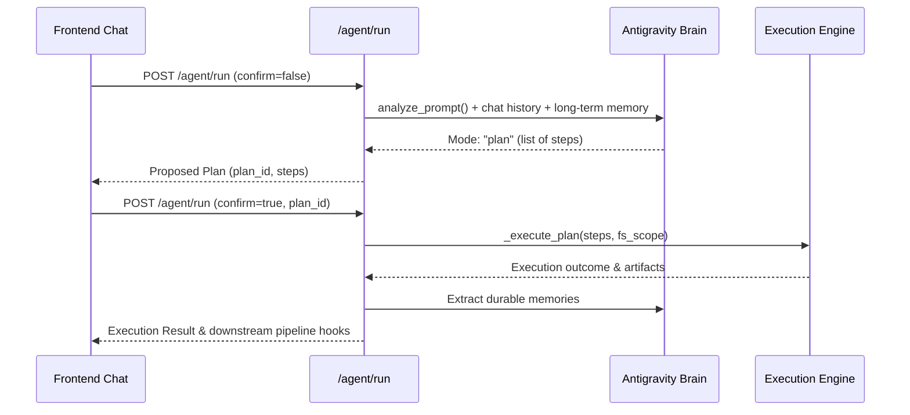

# `app/api/` — HTTP & SSE API Gateway

## 1. Directory Role & Boundary
The `app/api/` directory exposes the public HTTP REST API and real-time Server-Sent Events (SSE) interfaces consumed by the Next.js frontend. It performs request validation (Pydantic), error normalization, and routes invocations to the core engine and worker pools.

---

## 2. Route Inventory (`app/api/routes/`)
| File | Prefix | Key Endpoints & Responsibilities |
| :--- | :--- | :--- |
| [`agent.py`](file:///d:/AI-Automation/backend/app/api/routes/agent.py) | `/agent` | **Two-Phase Agent Cycle**: Phase 1 (`POST /agent/run`, `confirm=false`) analyzes prompts and returns proposed plans; Phase 2 (`confirm=true`) executes steps, extracts memories, and forks tasks. `DELETE /agent/history`: Clears chat memory. |
| [`workers.py`](file:///d:/AI-Automation/backend/app/api/routes/workers.py) | `/workers` | **Worker Management**: `POST /workers/fork`, `GET /workers/list`, `GET /workers/{id}`, `GET /workers/{id}/artifacts`, `POST /workers/{id}/approve-plan`, `POST /workers/{id}/reject-plan`, `GET /workers/{id}/test-results`, `GET /workers/{id}/handover`. **Real-Time Streams**: `GET /workers/{id}/stream` (raw CLI text SSE), `GET /workers/{id}/events` (lifecycle JSON SSE). |
| [`events.py`](file:///d:/AI-Automation/backend/app/api/routes/events.py) | `/events` | Real-time global event bus SSE stream (`GET /events/stream`), reactive pipeline hook inspection (`GET /events/hooks`), and audit logs (`GET /events/audit`). |
| [`tasks.py`](file:///d:/AI-Automation/backend/app/api/routes/tasks.py) | `/tasks` | SQLite task tracking CRUD (status updates, step logs, parent-child relationships). |
| [`system.py`](file:///d:/AI-Automation/backend/app/api/routes/system.py) | `/system` | System hardware status (battery, memory, CPU) and power management actions (sleep, lock). |
| [`tools.py`](file:///d:/AI-Automation/backend/app/api/routes/tools.py) | `/tools` | Catalog of all registered executable tools. |
| [`skills.py`](file:///d:/AI-Automation/backend/app/api/routes/skills.py) | `/skills` | Catalog of all registered multi-step skills. |
| [`pipelines.py`](file:///d:/AI-Automation/backend/app/api/routes/pipelines.py) | `/pipelines` | Automated event-driven pipeline definitions. |
| [`tts.py`](file:///d:/AI-Automation/backend/app/api/routes/tts.py) | `/agent/tts` | High-fidelity neural voice synthesis via Microsoft Edge TTS (`POST /agent/tts` streaming MP3, `GET /agent/tts/voices`). |
| [`health.py`](file:///d:/AI-Automation/backend/app/api/routes/health.py) | `/health` | Liveness health check returning `{ "status": "ok" }`. |

---

## 3. Two-Phase Agent Architecture (`agent.py`)

---

## 4. Critical Invariants & Gotchas
* **SSE Disconnect Handling**: Streaming endpoints (`/stream`, `/events`) must detect client disconnects (`await request.is_disconnected()`) and unsubscribe queues to prevent memory leaks.
* **Periodic Keep-Alive**: All SSE streams send `: keep-alive\n\n` comments every 30s to prevent ngrok and browser timeouts.
* **Workspace Resolution**: In `_fork_task` inside `agent.py`, the target filesystem scope follows strict priority:
  1. `params['fs_scope']`
  2. `request.fs_scope` (sent by UI scope picker)
  3. Path regex match in prompt (`in D:/...`)
  4. Fallback to `JARVIS_WORKSPACE` (`D:/workspace`)
